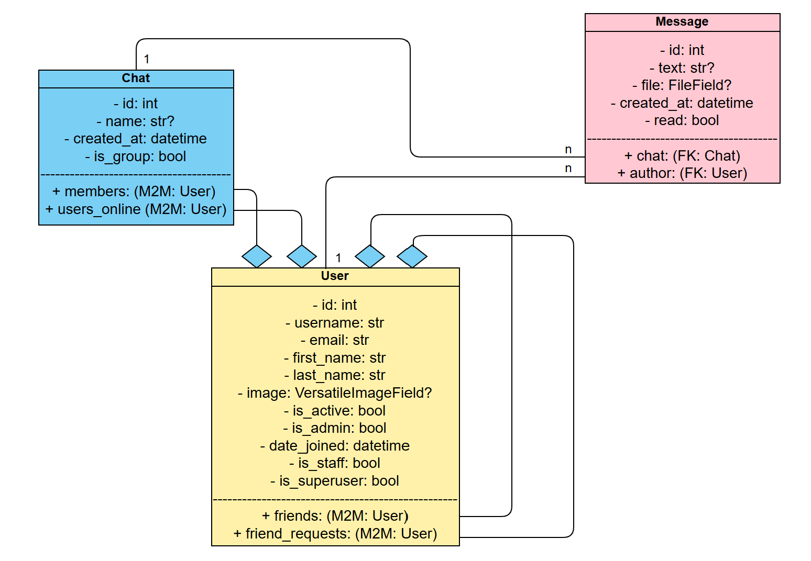
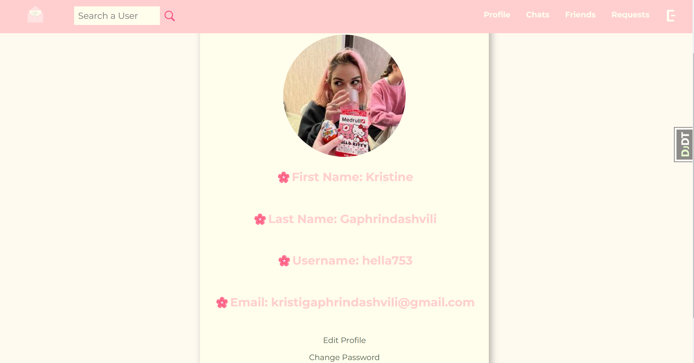
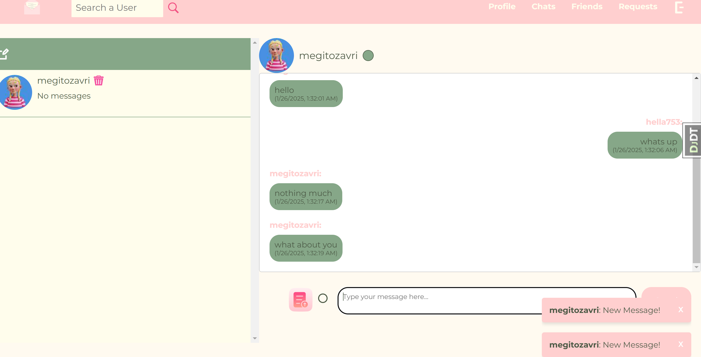
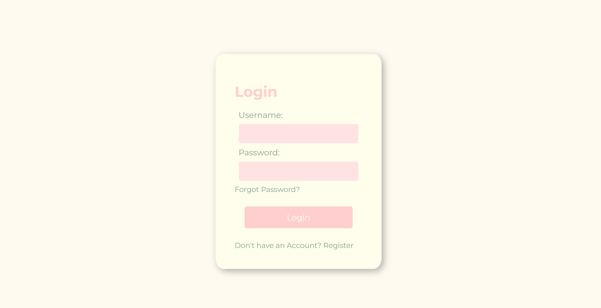
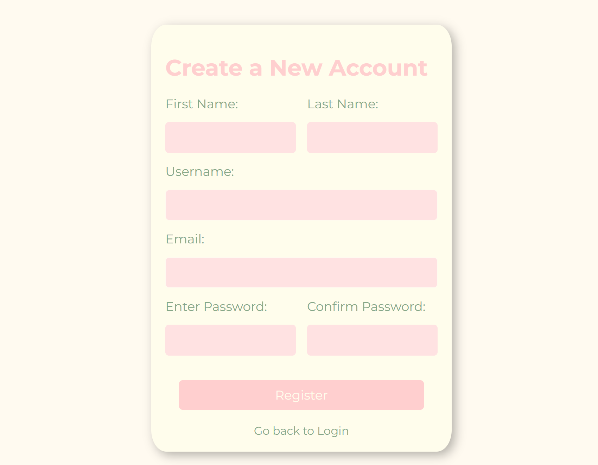

# Chat App

This is a simple chat app project built using Django, Django Channels, and JavaScript. 
The app allows users to create chat rooms and send messages to each other in real-time.

## Table of Contents
- [Features](#features)
  - [Accounts Features](#accounts-features)
  - [Chat Features](#chat-features)
  - [Other Features](#other-features)
- [Technologies Used](#technologies-used)
- [Installation](#installation)
- [Environment Variables](#environment-variables)
- [Routing](#routing)
- [Database Schema](#database-schema)
- [Components](#components)
  - [Accounts](#accounts)
  - [Chat](#chat)
  - [Consumers](#consumers)
  - [Celery Tasks](#celery-tasks)
  - [Utils](#utils)
  - [Signals](#signals)
- [HTML Templates and Static Files](#html-templates-and-static-files)
  - [TemplateTags](#templatetags)
- [Screenshots](#screenshots)
  - [Profile](#profile)
  - [Conversations](#conversations)
  - [Friends](#friends)
  - [Login](#login)
  - [Register](#register)

## Features

### Accounts Features
- User Registration/Verification/Login/Logout/Password Reset/
- User Profile update/Password Change
- User can upload profile picture
- Users can send friend requests to other users
- Users can accept or reject friend requests
- Users can see their friends list and unfriend other users


### Chat Features
- Start and Delete Conversations
- Send and Receive Messages in Real-time
- Attach Images and Files to Messages
- Create Group Chats with multiple users
- Online/Offline Status of Users when they are in the chat room


### Other Features
- Pagination for friends listings.
- Search for users
- In-app notifications for new messages and friend requests using Celery and Redis.


## Technologies Used
- Django
- Django Channels
- JavaScript
- HTML
- CSS
- Redis
- Celery

## Installation

1. Clone the repository
```bash
git clone https://github.com/hella753/chat_app.git
cd chat_app
```

2. Create a virtual environment and activate it
```bash
python3 -m venv venv
source venv/bin/activate
```

3. Install the requirements
```bash
pip install -r requirements.txt
```

4. Run the migrations
```bash
python manage.py migrate
```

5. Create a superuser
```bash
python manage.py createsuperuser
```

6. Run the server
```bash
python manage.py runserver
```

7. Open the browser and go to `http://127.0.0.1:8000/accounts/login/`
8. Create an account and start chatting!
9. To run the Celery worker, open a new terminal and run
```bash
celery -A chat_application.celery worker --pool=solo -l info
```


## Environment Variables
Create a `.env` file in the root directory and add the following variables:
```env
SECRET_KEY=your_secret_key
DEBUG=True
ALLOWED_HOSTS=
EMAIL_HOST=
EMAIL_PORT=
EMAIL_HOST_USER=
EMAIL_HOST_PASSWORD=
CELERY_BROKER_URL=
TIME_ZONE=
CELERY_RESULT_BACKEND=
```

## Routing

### Account URLs
- `/accounts/login/` - Login
- `/accounts/register/` - Register
- `/accounts/logout/` - Logout
- `/accounts/password-reset/` - Password Reset
- `/accounts/password-reset/done/` - Password Reset Done
- `/accounts/password-reset/<uidb64>/<token>/` - Password Reset Confirm
- `/accounts/password-reset_complete/` - Password Reset Complete
- `/accounts/verify/`- Verify Email
- `/accounts/my-profile/` - Current User Profile
- `/accounts/profile/<username>/` - User Profile
- `/accounts/my-profile/<str:username>/update/` - Update Profile
- `/accounts/my-profile/<str:username>/update/password/` - Update Password
- `/accounts/activate/<int:uid>/<str:token>/` - Activate Account
- `/accounts/friends/` - Friends List
- `/accounts/friends/requests/` - Friend Requests
- `/accounts/add-friend/<str:username>/` - Add Friend
- `/accounts/accept-friend/<str:username>/` - Accept Friend
- `/accounts/decline-friend/<str:username>/` - Reject Friend
- `/accounts/remove-friend/<str:username>/` - Remove Friend

### Chat URLs
- `/chat/chats/` - Chat Listing
- `/chat/<str:conversation>/` - Chat Detail
- `/chat/create/` - Start Chat
- `/chat/<str:conversation>/delete/` - Delete Chat


### Websockets
- `/ws/chat/<str:conversation>/` - Chat Room
- `/ws/notifications/` - Notifications
- `/ws/friend_requests/` - Friend Requests

## Database Schema



## Components

### Accounts
#### Views
- MyProfileView
- RegisterView
- ProfileDetailView
- ProfileUpdateView
- ProfileUpdatePasswordView
- VerificationView - User is verified by the token sent to their email.
- FriendListingView
- FriendRequestListingView
- AddFriendRequestView
- AcceptFriendRequestView
- DeclineFriendRequestView
- RemoveFriendView

#### Forms
- RegistrationForm
- ProfileUpdateForm
- UpdatePasswordForm

#### Managers
- UserManager


### Chat
#### Views
- ChatListingView
- ChatDetailView
- ChatCreationView
- ChatDeletionView

#### Forms
- ChatCreationForm
- ChatDeletionForm

### Consumers
Handle the WebSocket connections
- ChatConsumer
- NotificationConsumer
- FriendRequestConsumer

### Celery Tasks
- `send_notification()` — Send notifications to the user when they receive a message or friend request.
- `send_verification_email()` - Send verification email to the user when they register.


### Utils
- `activation_token_generator()` - Generates a token for email verification.

### Signals
- `send_notification_signal()` - Send notifications via calling the celery task to the user when they receive a message.


## HTML Templates and Static Files
- All the global HTML templates are in the `templates` directory.
- App-specific templates are in the `templates` directory of the respective app.
- Static files are in the `static` directory.
  - `static/images` - Images
  - `static/js` - JavaScript files
    - `static/js/chat` - JavaScript files for the chat websocket
    - `static/js/friends` - JavaScript files for the friend_request websocket
    - `static/js/notifications` - JavaScript files for the notification websocket
  - `static/css` - CSS files (Global)
    - `static/css/chat` - CSS files for the chat app
    - `static/css/emails` - CSS files for the emails
    - `static/css/user` - CSS files for the user app

### TemplateTags
- `get_extension()` in `chat/custom_filters.py` - Get the file extension of the file.


## Screenshots

### Profile


### Conversations


### Friends


### Login


### Register

